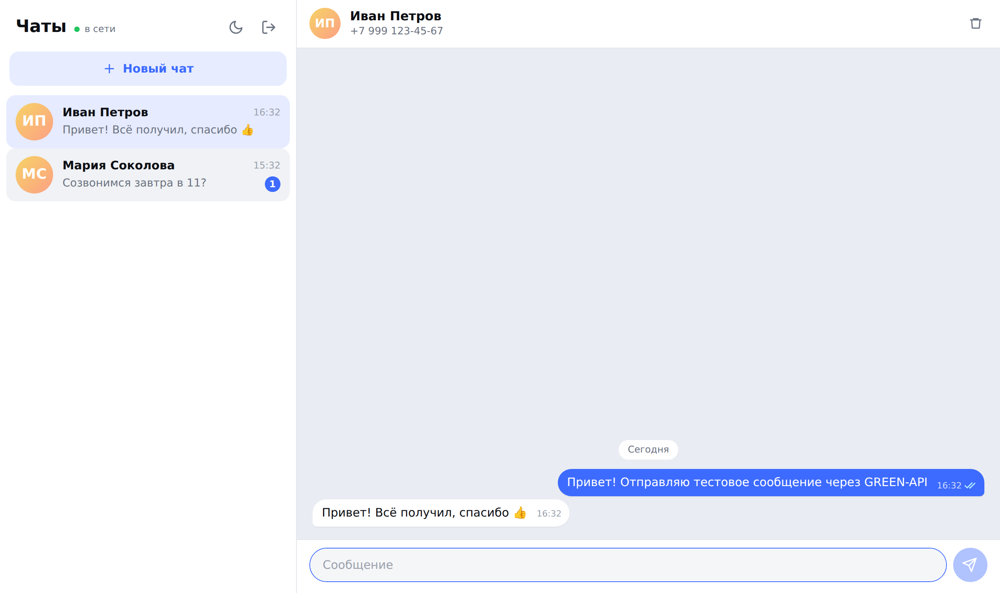
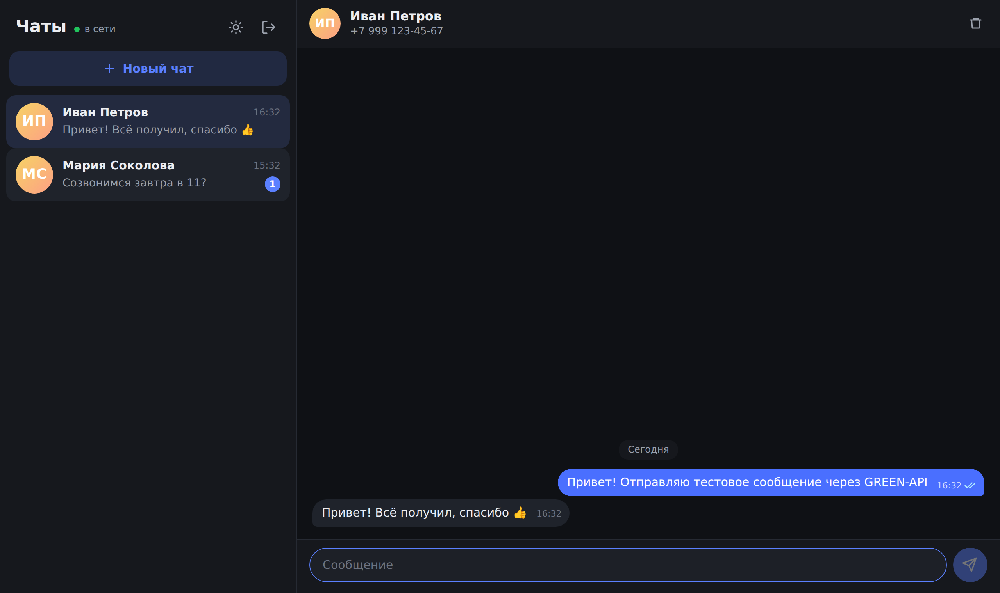
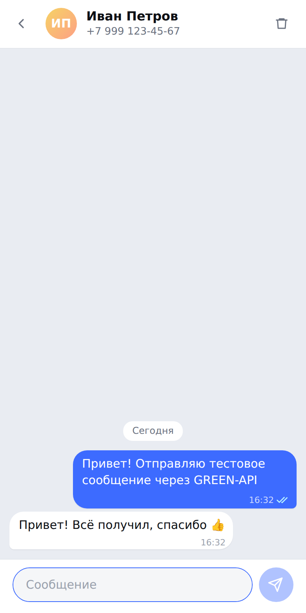
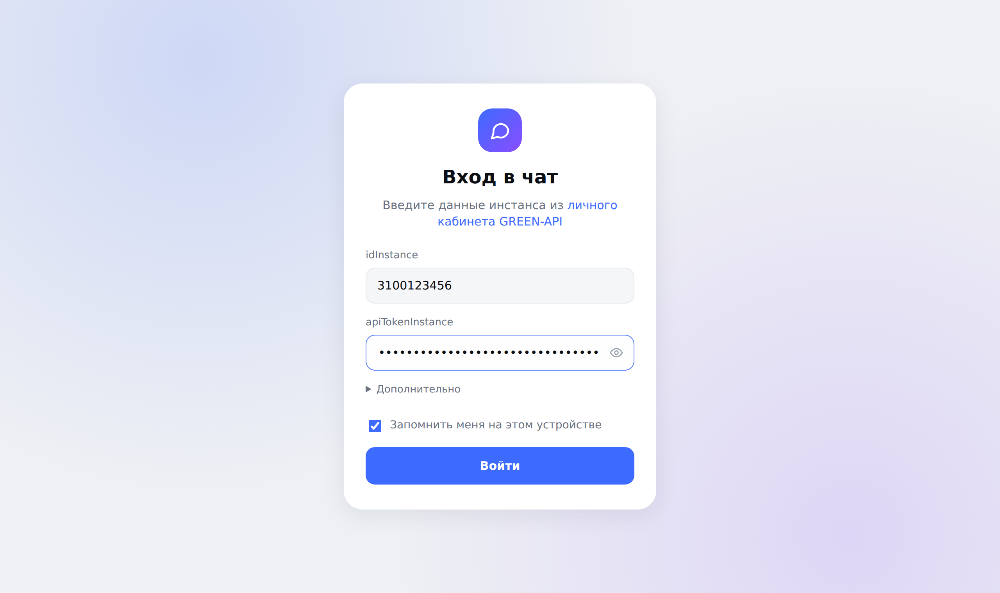

# MAX Chat · GREEN-API

Тестовое задание на позицию «Фронтенд-разработчик React» в GREEN-API.

Веб-интерфейс для отправки и получения текстовых сообщений в мессенджере **MAX** через сервис [GREEN-API](https://green-api.com/max). Внешний вид сделан по мотивам [web.max.ru](https://web.max.ru/).

**Демо:** https://plxryv.github.io/company-frontend-test/



<details>
<summary>Другие скриншоты: тёмная тема, мобильная версия, вход</summary>







</details>

## Что умеет

Сценарий из ТЗ:

1. Пользователь вводит свои учётные данные GREEN-API: `idInstance` и `apiTokenInstance`.
2. Вводит номер телефона получателя и создаёт новый чат.
3. Пишет текстовое сообщение и отправляет его в MAX (метод [SendMessage](https://green-api.com/v3/docs/api/sending/SendMessage/)).
4. Получатель отвечает в мессенджере MAX.
5. Ответ появляется в чате (технология [HTTP API](https://green-api.com/v3/docs/api/receiving/technology-http-api/): `ReceiveNotification` + `DeleteNotification`).

Сверх минимума, но без лишних функций:

- проверка данных при входе через `getStateInstance` с понятными ошибками (инстанс не авторизован, неверный токен и т. д.);
- статусы сообщений: отправляется → отправлено → доставлено → прочитано, ошибка с кнопкой «Повторить»;
- несколько чатов, счётчик непрочитанных; если человек написал первым, чат создаётся сам;
- история хранится в браузере отдельно для каждого инстанса;
- светлая и тёмная тема, адаптивная вёрстка для телефона;
- индикатор соединения и автоматическое переподключение с нарастающей паузой.

## Запуск локально

Нужен Node.js 20+.

```bash
git clone https://github.com/PLXRYV/company-frontend-test.git
cd company-frontend-test
npm install
npm run dev
```

Откройте http://localhost:5173 и введите `idInstance` и `apiTokenInstance` из [личного кабинета GREEN-API](https://console.green-api.com). Инстанс должен быть авторизован (QR-код в личном кабинете).

> Для получения сообщений в настройках инстанса должно быть включено «Получать уведомления о входящих сообщениях», а поле `webhookUrl` должно быть пустым. Так настроено по умолчанию.

Другие команды:

| Команда | Что делает |
| --- | --- |
| `npm test` | unit- и интеграционные тесты (Vitest + Testing Library) |
| `npm run build` | проверка типов и production-сборка в `dist/` |
| `npm run preview` | локальный просмотр production-сборки |
| `npm run lint` | линтер (oxlint) |

## Стек

React 19, TypeScript, Vite, CSS Modules. Без UI-библиотек и стейт-менеджеров: для такой задачи хватает `useReducer`, а бандл остаётся маленьким (~78 КБ gzip).

## Архитектура

```
src/
├── api/
│   ├── greenApi.ts           # тонкий клиент GREEN-API + понятные тексты ошибок
│   └── types.ts              # типы запросов и уведомлений
├── lib/
│   ├── notifications.ts      # уведомление GREEN-API → событие приложения
│   ├── phone.ts              # нормализация и валидация номера
│   ├── storage.ts            # localStorage / sessionStorage
│   └── format.ts             # даты, инициалы, цвета аватаров
├── store/
│   └── chatReducer.ts        # всё состояние чатов, чистые функции
├── hooks/
│   ├── useMessenger.ts       # логика мессенджера: отправка, создание чата, история
│   ├── useNotificationPolling.ts  # цикл получения уведомлений
│   └── useTheme.ts
└── components/               # UI: вход, список чатов, окно чата, сообщения
```

Ключевые решения:

- **Слои разделены.** Компоненты ничего не знают о формате GREEN-API: `parseNotification` превращает уведомления в простые события, а вся логика состояния живёт в чистом редьюсере. Поэтому основная логика покрыта быстрыми тестами без DOM.
- **Чат по номеру и chatId MAX.** В MAX ответы приходят с числовым `chatId`, а не с номером. Поэтому при создании чата номер проверяется методом [CheckAccount](https://green-api.com/v3/docs/api/service/CheckAccount/): он возвращает `chatId`, по которому потом сопоставляются ответы. Если проверка недоступна (лимит, таймаут), сообщение отправляется по номеру `7999…@c.us`, а chatId запоминается из первого ответа.
- **Очередь уведомлений.** Опрос идёт последовательно, потому что очередь отдаёт уведомления строго по порядку (FIFO). Используется long polling (`receiveTimeout=20`), так что лишних запросов нет. Каждое уведомление удаляется после обработки, даже неподдерживаемое, иначе очередь «застрянет».
- **Оптимистичная отправка.** Сообщение появляется сразу, а после ответа `sendMessage` получает настоящий `idMessage`. Дубликаты из уведомлений `outgoingAPIMessageReceived` отсекаются, статусы не откатываются назад, если пришли не по порядку.
- **Хост API** по умолчанию определяется по `idInstance` (первые 4 цифры, например `https://3100.api.green-api.com`). Если в личном кабинете указан другой адрес, его можно задать в поле «Дополнительно».

## Безопасность

Приложение работает целиком в браузере и обращается к GREEN-API напрямую, собственного сервера нет. Токен хранится только в браузере пользователя: в `localStorage`, если отмечено «Запомнить меня», иначе в `sessionStorage` до закрытия вкладки. Кнопка «Выйти» удаляет данные входа.

## Деплой

GitHub Actions (`.github/workflows/deploy.yml`) при каждом пуше в `main` запускает линтер, тесты и сборку и публикует `dist/` на GitHub Pages.
